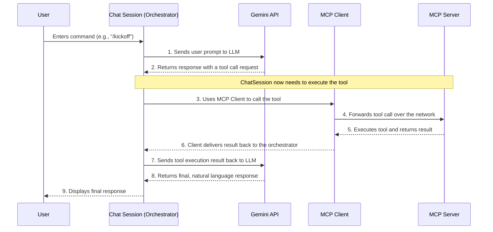

# MCP Meeting Assistant

This project is a demonstration of the **Model Context Protocol (MCP)** framework, showcasing a simple but powerful meeting assistant powered by Google's Gemini large language model (LLM). The assistant can schedule meetings, manage attendees, track action items, and generate summaries, all through an interactive command-line interface.

## Features

  * **Interactive Chat Interface**: A user-friendly command-line chat for managing your meetings.
  * **Schedule Meetings**: Easily create new meetings.
  * **Manage Attendees**: Add participants to any scheduled meeting.
  * **Track Action Items**: Record action items for each meeting.
  * **Generate Summaries**: Get a quick overview of a meeting's details.
  * **Slash Commands**: Use simple slash commands for common actions like `/kickoff` to start a new project meeting or `/minutes` to generate meeting minutes.
  * **Demo Mode**: Quickly populate the application with sample data using the `/demo` command to see it in action.

-----

## Getting Started

This project includes a [Dev Container](https://containers.dev/) configuration, which allows you to create a consistent and isolated development environment.

### Prerequisites

  * [Docker](https://www.docker.com/)
  * [Visual Studio Code](https://code.visualstudio.com/)
  * An API key for the Gemini API. You can get one from [Google AI Studio](https://makersuite.google.com/).

### Installation with Dev Container

1.  **Clone the repository:**
    ```bash
    git clone https://github.com/massimilianobotticelli/mcp-meeting-assistant.git
    cd mcp-meeting-assistant
    ```
2.  **Set up your environment variables:** Create a file named `.env` in the root of the project and add your Gemini API key:
    ```
    GEMINI_API_KEY="YOUR_API_KEY"
    ```
3.  **Open in Dev Container:** Open the project folder in Visual Studio Code. You will see a notification in the bottom-right corner asking if you want to "Reopen in Container". Click it to launch the Dev Container. This will build the container and install all the necessary dependencies.

### Manual Installation

If you prefer not to use the Dev Container, you can set up the project manually:

1.  **Clone the repository:**
    ```bash
    git clone https://github.com/massimilianobotticelli/mcp-meeting-assistant.git
    cd mcp-meeting-assistant
    ```
2.  **Create a virtual environment and install dependencies:** This project uses `uv` for package management.
    ```bash
    # Create a virtual environment
    python -m venv .venv
    source .venv/bin/activate

    # Install dependencies using uv
    pip install uv
    uv pip install -e .
    ```
3.  **Set up your environment variables:** Create a file named `.env` in the root of the project and add your Gemini API key:
    ```
    GEMINI_API_KEY="YOUR_API_KEY"
    ```

-----

## Usage

To start the meeting assistant, run the `main.py` script:

```bash
python src/mcp_meeting_assistant/main.py
```

This will launch an interactive chat session. You can type `exit` at any time to quit the application.

### Available Commands

  * `/kickoff`: Plan a new project kickoff meeting.
  * `/minutes`: Generate meeting minutes from the details.
  * `/format`: Format all meetings into a markdown report.
  * `/demo`: Populate the server with random meeting data for a demo.

-----

## Architecture

The application's architecture is designed around an orchestrator (`ChatSession`) that manages the flow of information between the user, the Large Language Model (Gemini), and the local tool server (MCP Server).



-----

## Project Structure

The project follows a standard Python application layout:

```
.
├── .devcontainer/        # VS Code Dev Container configuration
│   ├── devcontainer.json # Dev Container settings
│   └── post-create.sh    # Setup script for the container
├── src/
│   └── mcp_meeting_assistant/
│       ├── main.py           # Main application entry point
│       ├── mcp_server.py     # Core server logic and tool definitions
│       ├── models/
│       │   └── gemini.py     # Wrapper for the Gemini API
│       ├── chat_session.py   # Manages the interactive chat
│       └── mcp_client.py     # Client for the MCP server
└── pyproject.toml          # Project dependencies and metadata
```

This structure clearly separates the application's core logic (`src/mcp_meeting_assistant`) from the development environment setup (`.devcontainer`) and project configuration (`pyproject.toml`).

-----

## Extensibility

### Using Other LLMs

The project is designed to be easily adaptable to other Large Language Models. The `src/mcp_meeting_assistant/models/gemini.py` file provides a wrapper for the Google Gemini API and can be used as a template for integrating other models.

To switch to a different LLM, you would need to:

1.  Create a new wrapper class in the `models` directory that conforms to the same interface as the `Gemini` class.
2.  Update the `main.py` file to instantiate your new LLM client instead of the `Gemini` client.

-----

## Contributing

Contributions are welcome\! If you have ideas for improvements or new features, please feel free to open an issue or submit a pull request.

-----

## License

This project is licensed under the MIT License - see the [LICENSE](https://github.com/massimilianobotticelli/mcp-meeting-assistant/blob/main/LICENSE) file for details.